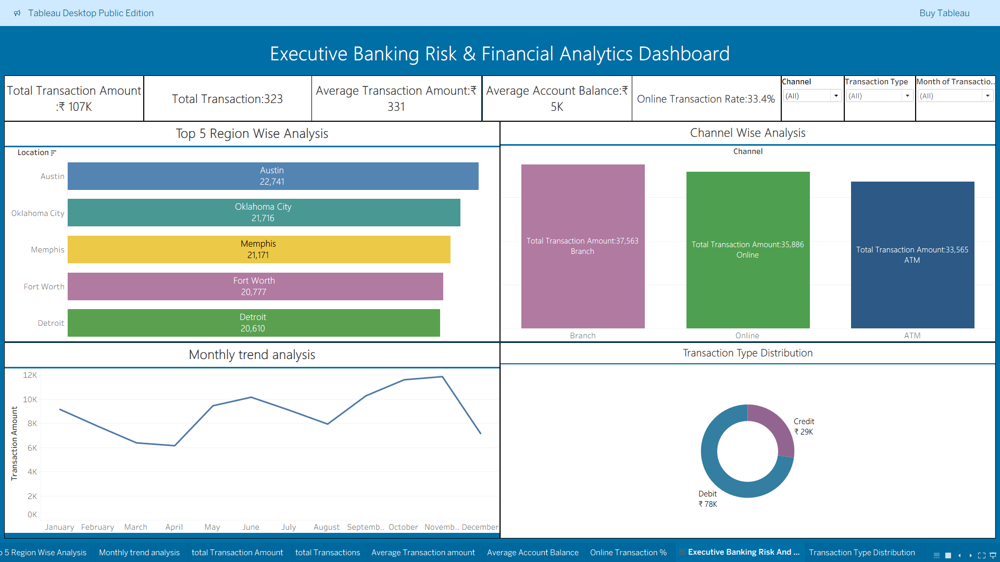

# 🚨 Banking Transaction Risk & Financial Reporting System

### Enterprise-Grade Banking Analytics, Risk Monitoring & Executive Reporting Platform

<p align="center">
  
  
  
  
  
</p>

---

# 📌 Executive Overview

Financial institutions process massive volumes of transactions daily, making accurate financial reporting and proactive risk monitoring essential for operational stability and fraud prevention.

This project simulates an enterprise-grade **Banking Transaction Risk & Financial Reporting System** designed to help banking organizations:

* Monitor high-risk transactions
* Analyze transaction behavior patterns
* Track branch-level financial performance
* Identify operational anomalies
* Improve executive decision-making
* Support centralized reporting workflows

The solution combines **SQL analytics**, **financial KPI engineering**, and **interactive Power BI dashboards** to deliver business-focused banking intelligence.

---

# 🎯 Business Problem

Traditional banking reporting systems often struggle with:

* Delayed risk visibility
* Manual reporting processes
* Fragmented transaction monitoring
* Limited branch performance insights
* Poor anomaly detection
* Inefficient executive reporting

Without centralized analytics, financial institutions face challenges in identifying operational risks and making timely strategic decisions.

This project addresses these gaps through a scalable analytical reporting framework.

---

# 💼 Key Business Objectives

✔ Monitor high-risk transactions
✔ Analyze financial activity trends
✔ Improve operational transparency
✔ Track branch-level performance
✔ Deliver executive-ready KPI reporting
✔ Support risk-focused decision-making
✔ Centralize banking analytics workflows

---

# 🧠 Core Analytics Features

## 📊 Financial Risk Monitoring

* High-risk transaction analysis
* Suspicious transaction identification
* Transaction category risk assessment
* Exposure monitoring

## 🏦 Banking Operations Analytics

* Branch performance tracking
* Transaction volume analysis
* Deposit vs withdrawal trends
* Customer activity monitoring

## 📈 Executive Reporting

* Dynamic KPI dashboards
* Monthly financial trend analysis
* Revenue & transaction summaries
* Operational performance reporting

## ⚠ Risk Intelligence Layer

* Transaction anomaly indicators
* Risk segmentation analysis
* Financial exposure tracking
* Operational risk visualization

---

# 🛠 Tech Stack

| Technology        | Purpose                                       |
| ----------------- | --------------------------------------------- |
| **Power BI**      | Interactive dashboards & reporting            |
| **SQL**           | Data querying & analytics                     |
| **Excel / CSV**   | Raw banking datasets                          |
| **DAX**           | KPI calculations & measures                   |
| **Data Modeling** | Relationship management & schema optimization |

---

# 📂 Project Structure

```bash
Banking-Transaction-Risk-Financial-Reporting-System/
│
├── Dataset/
│   ├── banking_transactions.csv
│   ├── customer_data.csv
│
├── SQL/
│   ├── risk_analysis_queries.sql
│   ├── reporting_queries.sql
│
├── Dashboard/
│   ├── banking_risk_dashboard.pbix
│
├── Images/
│   ├── dashboard_preview.png
│
└── README.md
```

---

# 📊 Dashboard Highlights

## Executive KPI Dashboard

* Total Transactions
* Revenue Processed
* High-Risk Transaction %
* Operational Risk Indicators
* Active Customer Metrics

## Financial Reporting Dashboard

* Monthly transaction trends
* Branch-wise financial performance
* Revenue contribution analysis
* Transaction category distribution

## Risk Monitoring Dashboard

* Suspicious transaction analysis
* High-risk customer identification
* Transaction anomaly tracking
* Risk severity segmentation

## Operational Analytics

* Failed transaction monitoring
* Peak banking activity analysis
* Regional performance insights
* Banking operations trends

---

# 🔍 Advanced SQL Analytics

## High-Risk Transaction Analysis

```sql
SELECT customer_id,
       SUM(transaction_amount) AS total_risk_amount
FROM transactions
WHERE risk_level = 'High'
GROUP BY customer_id
ORDER BY total_risk_amount DESC;
```

## Monthly Financial Reporting

```sql
SELECT MONTH(transaction_date) AS month,
       SUM(transaction_amount) AS total_transaction_volume
FROM transactions
GROUP BY MONTH(transaction_date)
ORDER BY month;
```

---

# 📈 Business Impact Metrics

| Metric                            | Business Impact                                                |
| --------------------------------- | -------------------------------------------------------------- |
| ⚠ High-Risk Transaction Detection | Improved visibility into suspicious financial activity         |
| 📊 Reporting Efficiency           | Reduced manual reporting effort through centralized dashboards |
| 🏦 Branch Performance Tracking    | Enabled branch-level operational benchmarking                  |
| ⏱ Decision-Making Speed           | Faster executive insights through KPI dashboards               |
| 🔍 Transaction Monitoring         | Improved anomaly identification and risk segmentation          |
| 📈 Financial Trend Visibility     | Enhanced understanding of banking transaction patterns         |
| 💰 Revenue Analytics              | Better tracking of financial activity and transaction flow     |
| 🧠 Risk Intelligence              | Strengthened proactive financial risk assessment               |
| 📋 Compliance Reporting           | Simplified analytical reporting workflows                      |
| 🚀 Operational Transparency       | Improved enterprise-level financial visibility                 |

---

# 📌 Key Insights Generated

✔ High-value transactions contributed significantly to financial exposure
✔ Certain branches demonstrated elevated operational risk patterns
✔ Transaction spikes aligned with increased anomaly probability
✔ Executive dashboards improved reporting accessibility
✔ Centralized analytics enhanced operational visibility

---

# 🚀 Business Value

This system demonstrates how enterprise banking analytics can:

* Improve operational monitoring
* Strengthen financial visibility
* Enhance reporting efficiency
* Support data-driven banking decisions
* Streamline risk analysis workflows
* Enable executive-level financial intelligence

---

# 🏆 Skills Demonstrated

## Data Analytics

* Financial analytics
* Risk analysis
* Banking intelligence
* KPI engineering
* Business reporting

## Technical Skills

* SQL
* Power BI
* DAX
* Data modeling
* Dashboard engineering

## Business Understanding

* Financial reporting
* Banking operations
* Risk monitoring
* Executive analytics
* Operational intelligence

---

# 📷 Dashboard Preview

## Executive Risk Dashboard

> Add dashboard screenshots here

```markdown

```

---

# 📌 Why This Project Stands Out

Unlike generic dashboard projects, this solution demonstrates:

✅ Enterprise-style banking analytics
✅ Risk-focused business intelligence
✅ Executive-level reporting architecture
✅ Strong SQL analytical capability
✅ Production-oriented dashboard design
✅ Business-driven storytelling
✅ Financial operations understanding

This project aligns closely with roles such as:

* Financial Data Analyst
* Banking Analytics Associate
* Risk Analyst
* Business Intelligence Analyst
* Financial Reporting Analyst
* Fraud & Risk Analytics Analyst

---

# 🔮 Future Enhancements

* Real-time transaction monitoring
* Automated risk alerts
* ML-based fraud prediction
* Cloud-based deployment
* API integrations
* Predictive financial analytics
* AI-driven anomaly detection

---

# 👨‍💻 Author

# Vishal Singh

Aspiring Data & Financial Analytics Professional specializing in:

* Banking Analytics
* Risk Intelligence
* SQL Analytics
* Business Intelligence
* Financial Reporting
* Executive Dashboarding

---

# ⭐ Support The Project

If you found this project valuable, give this repository a ⭐ to support the work and showcase appreciation.

---

# 📬 Connect With Me

* GitHub: [github.com/vishaaaal15](https://github.com/vishaaaal15)
* LinkedIn:[linkedin.com/vishal-singhdataanalyst](https://linkedin.com/vishal-singhdataanalyst)

---

# 🔥 Recruiter Snapshot

### This project demonstrates:

✔ Advanced SQL analytics
✔ Enterprise dashboard development
✔ Financial domain understanding
✔ Risk-focused analytical thinking
✔ Executive reporting capability
✔ Production-level portfolio presentation
✔ Strong business intelligence storytelling

> Designed to reflect real-world banking analytics and enterprise financial reporting workflows.
